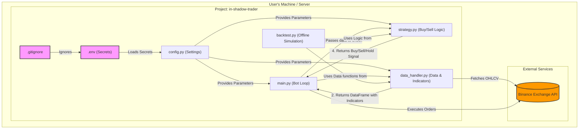

# Project To-Do List: in-shadow-trader
นี่คือรายการสิ่งที่ต้องทำทั้งหมด แบ่งตามเฟสการพัฒนา ตั้งแต่เริ่มต้นจนถึงการนำไปใช้งานจริง
## Phase 1: Foundation & Setup (รากฐานและการตั้งค่า) - 100% Done
    1.1: Initialize Project & Git Repo: สร้างโปรเจกต์และ GitHub Repository
    1.2: Define AI Coding Rules: สร้างไฟล์ .claude.md เพื่อควบคุมสไตล์และกฎการเขียนโค้ดของ AI
    1.3: Secure Secret Management: สร้างไฟล์ .env และ .gitignore เพื่อจัดการ API    Keys อย่างปลอดภัย
    1.4: Install Dependencies: ติดตั้งไลบรารีที่จำเป็น (ccxt, pandas, pandas_ta,   python-dotenv)
    1.5: Create Configuration File: สร้างไฟล์ config.py  เพื่อจัดการพารามิเตอร์ทั้งหมดและโหลดข้อมูลลับจาก .env
    1.6: Refactor Code to Use Config: (Next Step) แก้ไขไฟล์ main.py, strategy.py, และ data_handler.py ให้ดึงค่าพารามิเตอร์ทั้งหมดจาก config.py
## Phase 2: Core Logic Development (การพัฒนา Logic หลัก) - 75% Done
    2.1: Data Handler Module: สร้าง data_handler.py เพื่อดึงข้อมูล OHLCV และคำนวณ     Indicators ทั้งหมด
    2.2: Strategy Module: สร้าง strategy.py เพื่อแปลงกลยุทธ์ (EMA, MACD, RSI, ADX,  Fibo) ให้เป็นเงื่อนไข Buy/Sell ที่ชัดเจน
    2.3: Main Bot Loop: สร้าง main.py เพื่อสร้าง Loop การทำงานหลัก, จัดการสถานะ   (in_position), และจำลองการตัดสินใจ
    2.4: Implement Real Exchange Connection: สร้างฟังก์ชันใน main.py หรือไฟล์ใหม่     (exchange_handler.py) เพื่อเชื่อมต่อกับ Binance โดยใช้ API Key จาก config.py
    2.5: Implement Order Execution Logic: สร้างฟังก์ชัน create_buy_order() และ create_sell_order() ที่สามารถส่งคำสั่งจริงไปยัง Exchange ได้ (โดยคำนวณขนาด Lot จาก TRADE_QUANTITY_USD)
## Phase 3: Testing & Validation (การทดสอบและประเมินผล) - 0% Done
    3.1: Develop Backtesting Engine: สร้างสคริปต์ backtest.py     ที่สามารถนำกลยุทธ์จาก strategy.py ไปทดสอบกับข้อมูลย้อนหลัง (Historical Data)
    3.2: Run Backtesting & Analyze Results: ทดสอบกลยุทธ์กับข้อมูลย้อนหลังอย่างน้อย  1-3 ปี และวิเคราะห์ผลลัพธ์ (Total Return, Win Rate, Max Drawdown)
    3.3: Strategy Optimization: ปรับจูนพารามิเตอร์ใน config.py     ตามผลลัพธ์ที่ได้จากการ Backtest เพื่อหากลยุทธ์ที่มีประสิทธิภาพสูงสุด
    3.4: Paper Trading: นำบอทไปรันกับบัญชีทดลอง (Testnet) ของ Binance เพื่อทดสอบการทำงานในสภาพตลาดจริงโดยไม่ใช้เงินจริง
## Phase 4: Deployment & Monitoring (การนำไปใช้งานและติดตามผล) - 0% Done
    4.1: Add Robust Logging: เพิ่มระบบบันทึกข้อมูล (Logging)     เพื่อเก็บประวัติการตัดสินใจ, การซื้อขาย, และข้อผิดพลาดทั้งหมดลงในไฟล์ Log
    4.2: Add Notification System: (Optional) สร้างระบบแจ้งเตือนผ่าน LINE Notify    หรือ Telegram เมื่อมีการซื้อ/ขายเกิดขึ้น
    4.3: Prepare for Deployment: เตรียมสภาพแวดล้อมสำหรับรันบอท 24/7 (เช่น    บนเซิร์ฟเวอร์คลาวด์ VPS หรือ Raspberry Pi)
    4.4: Deploy and Monitor: นำบอทไปรันใช้งานจริงและคอยติดตามผลการทำงานและ Log อย่างสม่ำเสมอ
# Project Architecture: in-shadow-trader
นี่คือแผนภาพโครงสร้างสถาปัตยกรรมที่แสดงให้เห็นว่าแต่ละไฟล์และส่วนประกอบทำงานเชื่อมต่อกันอย่างไร

คำอธิบายแผนภาพ:
หัวใจของระบบ (main.py): เป็นศูนย์กลางควบคุมที่ทำงานเป็น Loop คอยสั่งการโมดูลอื่นๆ
การไหลของข้อมูล (Data Flow):
main.py สั่งให้ data_handler.py ไปดึงข้อมูลจาก Binance API
data_handler.py คำนวณ Indicator แล้วส่งข้อมูล (DataFrame) กลับมาให้ main.py
main.py ส่งข้อมูลนั้นต่อให้ strategy.py เพื่อทำการวิเคราะห์
strategy.py ส่งผลการวิเคราะห์ (สัญญาณ ซื้อ/ขาย/ถือ) กลับมาให้ main.py
main.py ตัดสินใจและส่งคำสั่งซื้อขายกลับไปยัง Binance API
การตั้งค่าและความปลอดภัย:
ไฟล์ .env เก็บข้อมูลลับไว้ และถูก gitignore ป้องกันไม่ให้อัปโหลดขึ้นไป
config.py ทำหน้าที่อ่านข้อมูลลับจาก .env และรวมกับพารามิเตอร์อื่นๆ แล้วส่งต่อให้โมดูลที่ต้องการใช้งาน
การทดสอบ (backtest.py): เป็นโมดูลแยกที่จะถูกสร้างขึ้นในอนาคต โดยจะดึงเอา Logic จาก strategy.py และฟังก์ชันข้อมูลจาก data_handler.py มาใช้เพื่อจำลองการเทรดกับข้อมูลในอดีตโดยไม่ต้องเชื่อมต่อกับ API จริง
